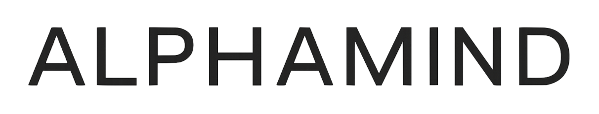

 

  

<h1 align="center">TAO20 Index - Transparency Portal</h1>

The TAO20 Index is a top-20 emissions-weighted Bittensor subnet index that automatically rebalances every two weeks based on real-time network data. This repository provides complete transparency into the index composition and underlying data.

## What You'll Find

### Daily Emissions Data
- **Source**: Live Bittensor Finney network
- **Schedule**: Updated daily at 16:00 UTC
- **Location**: `emissions/` folder
- **Format**: JSON files with complete subnet emission rates

### TAO20 Index Composition
- **Methodology**: 14-day rolling average of emissions, top 20 subnets
- **Schedule**: Rebalanced every second Sunday at 16:30 UTC
- **Location**: `tao20/` folder
- **Format**: JSON files with index weights and metadata

## Methodology

The TAO20 Index uses a systematic approach to ensure fair representation of the most active Bittensor subnets:

1. **Data Collection**: Daily extraction of emission rates from all active subnets
2. **Filtering**: Excludes subnet 0 (root network) and inactive subnets
3. **Calculation**: 14-day rolling average of emission rates
4. **Selection**: Top 20 subnets by average emissions
5. **Weighting**: Normalized to ensure total portfolio weight equals 100%

## Data Integrity

- **Real-time Source**: All data comes directly from Bittensor's blockchain
- **Automated Collection**: No human intervention or manual data manipulation
- **Complete Audit Trail**: Every update is tracked via Git commits
- **Public Verification**: All calculations can be independently verified

## Access

Browse the `emissions/` and `tao20/` folders to access:
- Latest daily emission snapshots
- Current TAO20 index composition
- Historical data via Git history
- Complete metadata and statistics

---

*This repository represents our commitment to complete transparency in TAO20 index fund management.*
