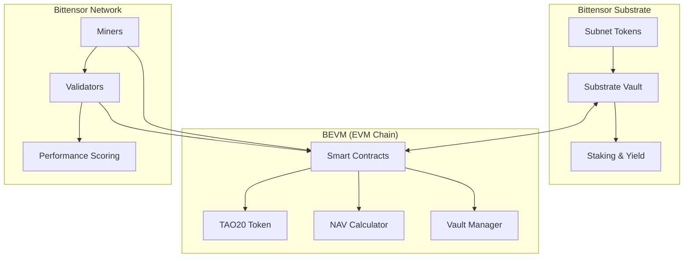

# 🚀 TAO20 - Decentralized Bittensor Subnet Index

**The first decentralized index token for the Bittensor ecosystem, providing diversified exposure to the top 20 subnets through a single, liquid ERC-20 token.**

[](https://opensource.org/licenses/MIT)
[](https://soliditylang.org/)
[](https://getfoundry.sh/)

## 🎯 **What is TAO20?**

TAO20 is a revolutionary decentralized index token that:

- **🌟 Tracks Top 20 Subnets**: Automatically follows the best-performing Bittensor subnets
- **💰 Provides Instant Liquidity**: Trade subnet exposure without managing 20 individual positions
- **🔗 Bridges Ecosystems**: Connects Bittensor Substrate with BEVM for DeFi compatibility
- **⚡ Generates Yield**: Underlying assets automatically staked for additional returns
- **🎯 Market-Driven Pricing**: Free-floating price discovery based on real asset values

## ✨ **Key Features**

### 🏗️ **Architecture Excellence**
- **Oracle-Free Design**: No external dependencies that can be manipulated
- **Cross-Chain Integration**: Seamless Substrate ↔ BEVM asset bridging
- **Immutable Contracts**: No admin controls or upgrade mechanisms
- **Market-Based NAV**: Real-time valuation from underlying assets

### 🔒 **Security First**
- **Ed25519 Verification**: Cryptographic proof of cross-chain deposits
- **Audit-Ready Code**: Clean, well-documented smart contracts
- **Decentralized Operation**: No single points of failure
- **Transparent Logic**: Open-source NAV calculation

### ⚡ **Performance Optimized**
- **Gas Efficient**: Optimized smart contract operations
- **Fast Settlement**: Sub-second transaction confirmation
- **Scalable Design**: Supports high transaction volumes
- **Low Fees**: Minimal operational overhead

## 🏗️ **System Architecture**



## 🚀 **Quick Start**

### **For Users**
```bash
# 1. Get TAO20 tokens by depositing subnet tokens
# 2. Enjoy diversified Bittensor exposure
# 3. Earn yield from automatic staking
# 4. Trade on any DeFi protocol
```

### **For Developers**
```bash
# Clone the repository
git clone https://github.com/yourusername/alphamind
cd alphamind

# Install dependencies
make install

# Run local development
make local-dev

# Deploy to testnet
make deploy-testnet
```

### **For Miners & Validators**
```bash
# Set up miner (processes mint/redeem requests)
cd core/neurons/miner
python setup.py install

# Set up validator (scores miner performance)
cd core/neurons/validator  
python setup.py install
```

## 📊 **How It Works**

### **🔄 For Users**

**Minting TAO20:**
1. Deposit subnet tokens to Substrate vault
2. Prove ownership with Ed25519 signature
3. Receive TAO20 tokens based on current NAV
4. Your tokens automatically earn staking yield

**Redeeming TAO20:**
1. Burn TAO20 tokens through smart contract
2. Receive proportional subnet tokens back
3. Tokens transferred to your Substrate address

### **⛏️ For Miners**
- **Focus**: Process mint/redeem requests efficiently
- **Earnings**: Collect fees from successful operations
- **Requirements**: Reliable infrastructure, fast response times

### **🏛️ For Validators**
- **Focus**: Score miner performance fairly
- **Earnings**: Bittensor emission rewards
- **Requirements**: Monitor system, evaluate metrics

## 🛠️ **Technology Stack**

| Component | Technology | Purpose |
|-----------|------------|---------|
| **Smart Contracts** | Solidity 0.8.21 | Core logic and token management |
| **Development** | Foundry | Contract development and testing |
| **Cross-Chain** | BEVM Precompiles | Bittensor ↔ BEVM integration |
| **Backend** | Python 3.9+ | Miner/Validator implementation |
| **Blockchain** | BEVM | EVM-compatible execution layer |
| **Asset Custody** | Bittensor Substrate | Secure subnet token storage |

## 📚 **Documentation**

### **🎯 Quick Links**
- [📐 Architecture Overview](docs/architecture/overview.md)
- [🚀 Deployment Guide](docs/deployment/testnet-guide.md)
- [👥 User Guide](docs/user/getting-started.md)
- [🔧 API Documentation](docs/api/contracts.md)

### **🧑‍💻 For Developers**
- [🏠 Local Setup](docs/deployment/local-setup.md)
- [🧪 Testing Guide](docs/api/testing.md)
- [🔒 Security Model](docs/architecture/security.md)
- [🔗 Integration Examples](docs/api/integration.md)

### **🎯 For Users**
- [💰 Minting Guide](docs/user/minting-guide.md)
- [🔄 Redemption Guide](docs/user/redemption-guide.md)
- [❓ FAQ](docs/user/faq.md)

## 🎯 **Project Status**

### **✅ Completed**
- Smart contract architecture and implementation
- Cross-chain integration with Bittensor precompiles
- Oracle-free NAV calculation system
- Comprehensive testing suite (15/15 tests passing)
- Python integration for miners and validators
- Local development environment
- Security audit preparation

### **🔄 In Progress**
- BEVM testnet deployment and validation
- Real precompile integration testing
- Documentation finalization
- Community feedback integration

### **📋 Roadmap**
- **Q4 2024**: Testnet launch and private testing
- **Q1 2025**: Security audit and public testing
- **Q2 2025**: Mainnet launch and ecosystem integration
- **Q3 2025**: Advanced features and governance

## 🤝 **Contributing**

We welcome contributions from the community! Please see our [Contributing Guide](CONTRIBUTING.md) for details.

### **Ways to Contribute**
- 🐛 Report bugs and suggest improvements
- 📖 Improve documentation
- 🔧 Submit code improvements
- 🧪 Help with testing and QA
- 💡 Propose new features

## 🔒 **Security**

Security is our top priority. The TAO20 system includes:

- **Immutable smart contracts** with no admin privileges
- **Oracle-free design** eliminating external manipulation
- **Cross-chain cryptographic verification**
- **Comprehensive testing** and audit preparation

For security issues, please email: security@tao20.com

## 📄 **License**

This project is licensed under the MIT License - see the [LICENSE](LICENSE) file for details.

## 🌟 **Community & Support**

### **Connect With Us**
- 💬 **Discord**: [Join our community](https://discord.gg/tao20)
- 🐦 **Twitter**: [@TAO20Official](https://twitter.com/TAO20Official)
- 📧 **Email**: team@tao20.com
- 🐛 **Issues**: [GitHub Issues](https://github.com/yourusername/alphamind/issues)

### **Stay Updated**
- ⭐ Star this repository for updates
- 👀 Watch for releases and announcements
- 🔔 Follow us on social media

---

**🎉 Welcome to the future of decentralized subnet indexing! Together, we're building the infrastructure for the Bittensor ecosystem.**

---

<div align="center">

**Built with ❤️ for the Bittensor community**

[Documentation](docs/) • [Architecture](docs/architecture/overview.md) • [Deployment](docs/deployment/testnet-guide.md) • [Community](https://discord.gg/tao20)

</div>
