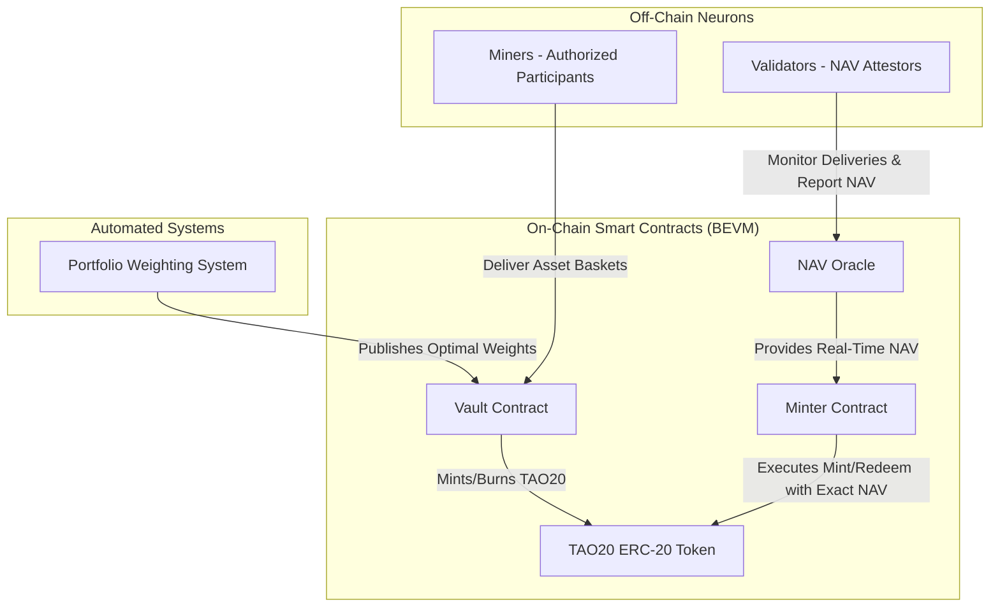

# TAO20: The Bittensor Index Fund

**TAO20 is a decentralized, un-gameable index fund for the Bittensor ecosystem, providing diversified exposure to the entire subnet economy through a single, powerful ERC-20 token.**

---

[](https://opensource.org/licenses/MIT)
[](https://discord.gg/YOUR_DISCORD_INVITE)

## 🎯 Overview

The TAO20 subnet introduces a sophisticated, ETF-style financial instrument to the Bittensor network. It allows anyone to invest in the collective intelligence and performance of all 20 subnets without needing to individually stake, trade, or manage multiple positions.

Our mission is to provide a **transparent, secure, and fully automated** on-chain index fund that is resistant to manipulation and reflects the true economic value of the Bittensor ecosystem.

## ✨ Key Features

- **🏛️ Professional ETF-Grade Architecture**: A decentralized, in-kind creation and redemption process inspired by real-world financial systems.
- **💰 Sophisticated Incentive Mechanism**: A multi-tiered reward system for miners (Authorized Participants) and validators that encourages deep liquidity and accurate NAV reporting.
- **🛡️ Bulletproof Smart Contracts**: Meticulously hardened contracts with real-time NAV integration, anti-replay protection, and emergency circuit breakers.
- **🤖 Fully Automated Portfolio Management**: An un-gameable, deterministic algorithm that rebalances the index portfolio based on real-time subnet emissions and performance.
- **🌐 Real-Time NAV Calculation**: Millisecond-precision Net Asset Value (NAV) calculation for exact, transparent pricing of all minting and redemption operations.

## 🏗️ Architecture Overview

The TAO20 subnet operates on a unique, three-part architecture that separates the roles of liquidity provision, validation, and on-chain asset management.



- **Miners (Authorized Participants)**: Source and deliver baskets of the 20 underlying subnet tokens to the Vault.
- **Validators**: Monitor these deliveries, calculate the exact NAV at the time of receipt, and provide cryptographic attestations.
- **Vault Contract**: Securely holds the underlying assets.
- **TAO20 ERC-20 Token**: Represents a share in the Vault's holdings.
- **NAV Oracle**: Provides real-time, manipulation-resistant NAV data to all other contracts.
- **Portfolio Weighting System**: An automated off-chain system that calculates and publishes the optimal portfolio weights for the index.

## 🚀 Getting Started

### Prerequisites

- **Python 3.8+**
- **Node.js & npm** (for smart contract development)
- **Foundry** (for smart contract testing and deployment)
- **Bittensor (`btcli`)**

### 1. Clone the Repository

```bash
git clone https://github.com/alphamind-project/alphamind.git
cd alphamind
```

### 2. Install Dependencies

```bash
# Install Python dependencies
pip install -r requirements.txt

# Install Node.js dependencies for smart contracts
cd contracts
npm install
```

### 3. Configure Your Environment

Copy the example environment file and fill in your details:

```bash
cp env.example .env
```

You will need to provide:
- `TAO20_WALLET_PATH`: Path to your Bittensor wallet.
- `TAO20_SOURCE_SS58`: Your Bittensor hotkey SS58 address.
- `TAO20_EVM_ADDR`: Your Ethereum/BEVM address for receiving TAO20 tokens.
- `BEVM_RPC_URL`: RPC URL for the BEVM network.

### 4. Running as a Miner or Validator

For detailed instructions on running a miner or validator neuron, please see our comprehensive **[User Guide](docs/USER_GUIDE.md)**.

```bash
# Example: Start a miner
python neurons/miner.py --wallet.name <your_wallet> --wallet.hotkey <your_hotkey>

# Example: Start a validator
python neurons/validator.py --wallet.name <your_wallet> --wallet.hotkey <your_hotkey>
```

## 📚 Documentation

Our documentation provides a deep dive into the architecture, core concepts, and security of the TAO20 subnet.

- **[📄 ARCHITECTURE.md](docs/ARCHITECTURE.md)**: A detailed overview of the entire system architecture.
- **[🧠 CORE_CONCEPTS](docs/CORE_CONCEPTS/)**: In-depth explanations of our key innovations:
  - **[Automated Portfolio Weighting](docs/CORE_CONCEPTS/AUTOMATED_PORTFOLIO_WEIGHTING.md)**
  - **[Real-Time NAV System](docs/CORE_CONCEPTS/REALTIME_NAV_SYSTEM.md)**
- **[🛡️ SMART_CONTRACTS.md](docs/SMART_CONTRACTS.md)**: A security-focused review of our bulletproof smart contracts.
- **[ GUIDE.md](docs/USER_GUIDE.md)**: A complete guide to setting up and running a miner or validator.

## 🤝 Contributing

We welcome contributions from the community! If you'd like to contribute, please read our [CONTRIBUTING.md](CONTRIBUTING.md) file for details on our code of conduct and the process for submitting pull requests.

## 📄 License

This project is licensed under the MIT License - see the [LICENSE](LICENSE) file for details.