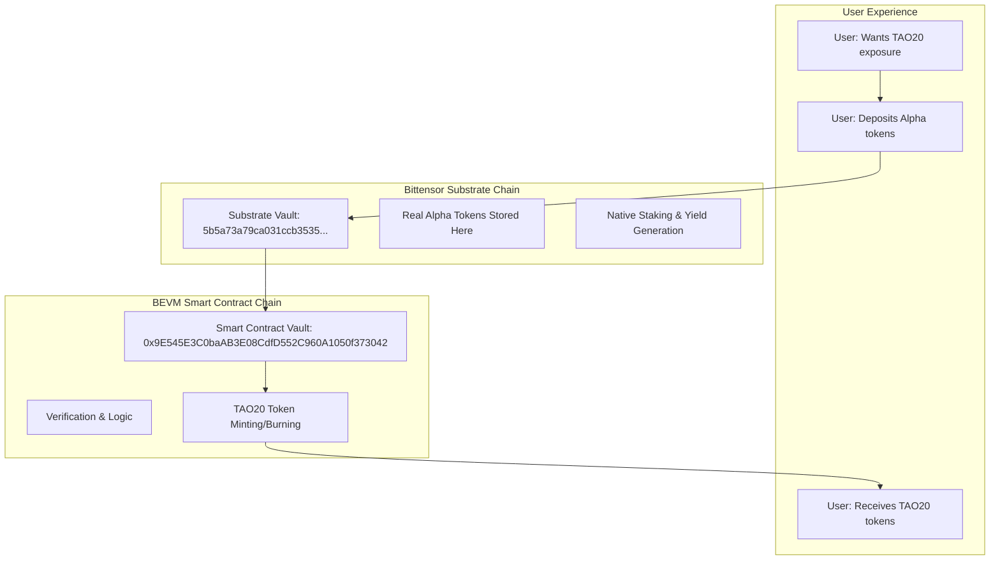

# 🔗 TAO20 Cross-Chain Architecture

## 🏗️ **Dual-Vault System Explained**

### **Why Two Different "Vaults"?**

The TAO20 system uses a sophisticated cross-chain architecture with **two complementary vaults**:

1. **🔗 Bittensor Substrate Vault** - The actual asset holder
2. **🏦 BEVM Smart Contract Vault** - The coordinator and verifier

---

## 🎯 **Architecture Overview**



---

## 🔄 **Address Derivation System**

### **How BEVM Contract Maps to Substrate Vault**

```solidity
// In Vault.sol constructor:
vaultSubstrateAddress = AddressUtils.getMyVaultAddress();

// Which calls:
function getMyVaultAddress() internal view returns (bytes32) {
    return evmToSubstrate(address(this));
}

// Which converts:
function evmToSubstrate(address evmAddress) internal pure returns (bytes32) {
    bytes memory data = abi.encodePacked("evm:", evmAddress);
    return keccak256(data);  // Simplified; real version uses Blake2b
}
```

### **Real Example:**

```bash
BEVM Contract Address:  0x9E545E3C0baAB3E08CdfD552C960A1050f373042
                              ↓ (deterministic derivation)
Substrate Vault Address: 5b5a73a79ca031ccb3535... (SS58 encoded)
```

---

## 📥 **Complete Minting Flow**

### **Step-by-Step Process:**

**1. User Initiation**
```bash
# User wants to mint 100 TAO20 tokens
# User has 100 Alpha tokens from subnet 1
```

**2. Substrate Deposit**
```bash
# User deposits Alpha tokens to Substrate vault
From: 5UserAddress...
To:   5b5a73a79ca031ccb3535... (TAO20 Substrate Vault)
Amount: 100 Alpha tokens (subnet 1)
```

**3. BEVM Verification**
```solidity
// Smart contract verifies deposit via precompiles
function verifyDeposit(DepositProof calldata proof) external {
    // Use Substrate query precompile to confirm deposit exists
    bool isValid = _verifySubstrateDeposit(proof);
    require(isValid, "Invalid deposit");
    
    // Update internal tracking
    subnetBalances[proof.netuid] += proof.amount;
    totalValueLocked += proof.amount;
}
```

**4. TAO20 Minting**
```solidity
// Mint equivalent TAO20 tokens to user
tao20Token.mint(user, tao20Amount);
```

**5. Result**
- ✅ User receives TAO20 tokens on BEVM
- ✅ Real Alpha tokens secured in Substrate vault
- ✅ Full audit trail maintained

---

## 📤 **Complete Redemption Flow**

### **Step-by-Step Process:**

**1. TAO20 Burn**
```solidity
// User burns TAO20 tokens to redeem Alpha tokens
tao20Token.burn(user, amount);
```

**2. Withdrawal Calculation**
```solidity
// Calculate how much Alpha to return based on current NAV
uint256 alphaAmount = (tao20Amount * currentNAV) / 1e18;
```

**3. Substrate Transfer**
```solidity
// Transfer Alpha from vault to user's SS58 address
_transferToSubstrate(user.ss58Address, netuid, alphaAmount);
```

**4. Balance Updates**
```solidity
// Update vault balances
subnetBalances[netuid] -= alphaAmount;
totalValueLocked -= alphaAmount;
```

---

## 🔒 **Security & Verification**

### **Cross-Chain Security Measures:**

**1. Deposit Verification**
```solidity
struct DepositProof {
    bytes32 blockHash;        // Substrate block hash
    uint32 extrinsicIndex;    // Transaction index in block
    bytes32 depositorSS58;    // Depositor's SS58 address
    uint16 netuid;            // Subnet ID
    uint256 amount;           // Deposited amount
    uint256 blockNumber;      // Block number
    uint256 timestamp;        // Block timestamp
}
```

**2. Replay Protection**
```solidity
// Prevent double-spending
mapping(bytes32 => bool) public processedDeposits;

bytes32 depositHash = keccak256(abi.encodePacked(
    proof.blockHash,
    proof.extrinsicIndex,
    proof.depositorSS58,
    proof.netuid,
    proof.amount
));

require(!processedDeposits[depositHash], "Already processed");
processedDeposits[depositHash] = true;
```

**3. Time-Based Validation**
```solidity
// Deposits must be recent to prevent old transaction replays
uint256 public constant MAX_DEPOSIT_AGE = 86400; // 24 hours
require(
    block.timestamp <= proof.timestamp + MAX_DEPOSIT_AGE,
    "Deposit too old"
);
```

---

## 🧪 **Current Implementation Status**

### **✅ Completed Components:**

**Smart Contract Layer:**
- ✅ Vault.sol with cross-chain logic
- ✅ Address derivation system
- ✅ Deposit/withdrawal structures
- ✅ Security mechanisms
- ✅ Event logging

**Testing Infrastructure:**
- ✅ Mock precompiles for development
- ✅ Local testing environment
- ✅ Integration test suite
- ✅ End-to-end flow validation

### **🔧 Needs Real Implementation:**

**Bittensor Integration:**
- ⚠️ Real Bittensor precompile calls
- ⚠️ Actual SS58 address encoding
- ⚠️ Blake2b hashing (currently using keccak256)
- ⚠️ Substrate transaction submission

**Production Features:**
- ⚠️ Multi-subnet token support
- ⚠️ Yield generation integration
- ⚠️ Advanced error handling
- ⚠️ Gas optimization

---

## 🚀 **Deployment Strategy**

### **Phase 1: BEVM Testnet**
```bash
# Deploy smart contracts to BEVM testnet
# Test with mock precompiles
# Validate basic functionality
```

### **Phase 2: Bittensor Integration**
```bash
# Integrate real Bittensor precompiles
# Test cross-chain functionality
# Validate security mechanisms
```

### **Phase 3: Production Launch**
```bash
# Deploy to BEVM mainnet
# Enable real Substrate vault
# Launch with limited asset support
```

---

## 💡 **Key Insights**

### **Why This Architecture?**

**1. Security:**
- Real assets stay on proven Bittensor chain
- Smart contract only handles coordination
- Multi-layer verification prevents attacks

**2. Efficiency:**
- Substrate handles native asset operations
- BEVM provides DeFi compatibility
- Minimal cross-chain overhead

**3. Scalability:**
- Support for all 20+ subnets
- Efficient batch operations
- Automatic yield generation

**4. User Experience:**
- Simple mint/redeem interface
- Standard ERC-20 compatibility
- Transparent pricing mechanisms

---

## 🎯 **Summary**

The TAO20 system uses a **sophisticated dual-vault architecture**:

- **🔗 Substrate Vault**: `5b5a73a79ca031ccb3535...` (Real asset custody)
- **🏦 BEVM Vault**: `0x9E545E3C0baAB3E08CdfD552C960A1050f373042` (Logic & coordination)

**This provides:**
- ✅ Maximum security for real assets
- ✅ DeFi compatibility for TAO20 tokens
- ✅ Transparent cross-chain operations
- ✅ Efficient yield generation
- ✅ User-friendly experience

**The architecture perfectly aligns with your vision of simple, secure, and efficient subnet token indexing!** 🎉
