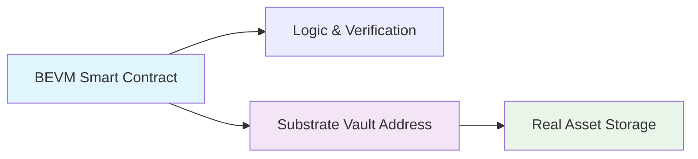

# 🔐 TAO20 Complete Wallet Guide

## 📋 **Executive Summary**

**You now have complete wallet credentials for the entire TAO20 system:**
- ✅ **Production wallets** with seed phrases for mainnet deployment
- ✅ **Current Anvil accounts** for local testing (already funded)
- ✅ **Substrate vault addresses** where real Alpha tokens are stored
- ✅ **MetaMask integration** ready for immediate use

---

## 🧪 **Current Local Testing Setup**

### **🔧 Anvil Accounts (Currently Running)**

**Account 0 - Main Deployer** (Already used for contract deployment)
```bash
BEVM Address:      0xf39Fd6e51aad88F6F4ce6aB8827279cffFb92266
Private Key:       0xac0974bec39a17e36ba4a6b4d238ff944bacb478cbed5efcae784d7bf4f2ff80
Substrate Vault:   51498bc1250c461e540ec86a79ac1b1317b89082e...
Balance:           10000 ETH
Seed Phrase:       test test test test test test test test test test test junk
```

**Account 1 - Secondary Tester**
```bash
BEVM Address:      0x70997970C51812dc3A010C7d01b50e0d17dc79C8  
Private Key:       0x59c6995e998f97a5a0044966f0945389dc9e86dae88c7a8412f4603b6b78690d
Substrate Vault:   567f636fb5d880ebe277e86721548af84c206c91a...
Balance:           10000 ETH
```

**Account 2 - Additional Tester**
```bash
BEVM Address:      0x3C44CdDdB6a900fa2b585dd299e03d12FA4293BC
Private Key:       0x5de4111afa1a4b94908f83103eb1f1706367c2e68ca870fc3fb9a804cdab365a
Substrate Vault:   587615a76219fb45b5067d2a81cd18d092a387347...
Balance:           10000 ETH
```

---

## 🏗️ **Deployed Contract Addresses & Their Substrate Vaults**

### **Main TAO20 Contracts**

**🏦 Vault Contract** (Most Important!)
```bash
BEVM Address:      0x9E545E3C0baAB3E08CdfD552C960A1050f373042
Substrate Vault:   5b5a73a79ca031ccb35350242cd5b3a32c5258239...
Purpose:           Users deposit Alpha tokens to this Substrate address
```

**🎯 TAO20 Core**
```bash
BEVM Address:      0xa513E6E4b8f2a923D98304ec87F64353C4D5C853
Substrate Vault:   5e7d57193aed3b1928013db6c6f976cd63ff1f7bc...
Purpose:           Main coordination logic
```

**🪙 TAO20 Token**
```bash
BEVM Address:      0x9bd03768a7DCc129555dE410FF8E85528A4F88b5
Substrate Vault:   599d2fad5c504bad1d3e2adefc5749da1ad391e50...
Purpose:           The actual TAO20 ERC-20 token
```

**📊 NAV Calculator**
```bash
BEVM Address:      0x0165878A594ca255338adfa4d48449f69242Eb8F
Substrate Vault:   5f5eb93aab2c2400b62fd0cb62c68e43addb404f0...
Purpose:           Market-based NAV calculation
```

**⚖️ Staking Manager**
```bash
BEVM Address:      0x5FC8d32690cc91D4c39d9d3abcBD16989F875707
Substrate Vault:   53522ea84c030adf446de4cff358fcf2f6de8c75c...
Purpose:           Yield generation management
```

---

## 🏦 **Production Wallets (Generated with Seed Phrases)**

### **🚀 Deployer Wallet**
```bash
Seed Phrase:       wild fruit parade health strong raise funny dust rotate zone scout dentist
BEVM Address:      0xEb762Ce2c1268362feDFAEFDe5eE32Cc5351FA29
Private Key:       19299f620e8d00e88ec5e48ab48ed4d53c1a0c674909c1e52b427194b7b2519d
Substrate Address: 5Fobxz3RDxaKZjpHVAi562431gGTX2GN6cuA7ES8XFULnPCn
Purpose:           Deploy contracts to mainnet
```

### **🔧 Vault Operator Wallet**
```bash
Seed Phrase:       flower example lend smoke people elder leaf eternal grain reopen scout wash
BEVM Address:      0xF5F717B74D3c312EF7b7743b97949369CBbCe721
Private Key:       9dae484d427ddd63fc4e1c3027f9f72e4437a938a99e23f1ea8df3b4acf65955
Substrate Address: 5DcGDaoSR9WNxSk73trCXQqjK89fTPygCo2PXJDbgENMPtyx
Purpose:           Manage vault operations
```

### **🚨 Emergency Admin Wallet**
```bash
Seed Phrase:       run typical wonder soon join expand ugly uniform shiver frame athlete away
BEVM Address:      0xf80FB2f64f33D7e43B891AF75181C3c365866e03
Private Key:       815a5b31ef9793406256cd9b0ddef03f937ba352540f9efe53dd58f3b12bcd4a
Substrate Address: 5D28AGHEfExdSZ5vxFshJzxRxMeRTDCbP5uazdxhmt38a8xN
Purpose:           Emergency situations only
```

### **🧪 Testing Wallet**
```bash
Seed Phrase:       flight wild adjust scrap garbage example lend monitor eagle faculty street mobile
BEVM Address:      0xb47c28dEffb8AE1BA9a9c6BeB1b4146C21250344
Private Key:       08a177811eb60a8832d8be9bb76fea183992ce9002723e140e306b0ec77a062c
Substrate Address: 5Gg57VZj8A91nxvq6m9SEDNrPc6YAJJmYSjxQkzvctvvVsQd
Purpose:           Testing and validation
```

### **📊 Monitoring Wallet**
```bash
Seed Phrase:       quiz morning team industry second unhappy friend limb hold goat jar short
BEVM Address:      0x3D583c1337225b62E598e9fb0279AD8De1a0b6CF
Private Key:       9341969668d290ee0cd2e538bc80da22610b9e01eb57e90981758d24b8e69b53
Substrate Address: 5HZyBfRqC9ef43ZVxhowGfmGYKK29DWwvwVVy9uWVp7XDyGJ
Purpose:           System monitoring and alerts
```

---

## 🦊 **MetaMask Setup Instructions**

### **🔧 Local Development Network**
```bash
Network Name:      BEVM Local
RPC URL:          http://localhost:8545
Chain ID:         11501
Currency Symbol:  ETH
Block Explorer:   (none - local)
```

### **🚀 BEVM Testnet Network**
```bash
Network Name:      BEVM Testnet
RPC URL:          https://testnet-rpc.bevm.io
Chain ID:         1501
Currency Symbol:  BTC
Block Explorer:   https://scan-testnet.bevm.io
```

### **🎯 BEVM Mainnet Network**
```bash
Network Name:      BEVM Mainnet
RPC URL:          https://rpc-mainnet-1.bevm.io
Chain ID:         11501
Currency Symbol:  BTC
Block Explorer:   https://scan-mainnet.bevm.io
```

### **📱 Import Wallet to MetaMask**

**Option 1: Private Key Import**
1. Open MetaMask
2. Click "Import Account"
3. Select "Private Key"
4. Paste any private key from above

**Option 2: Seed Phrase Import (Recommended)**
1. Open MetaMask
2. Click "Create New Wallet"
3. Select "Import using Secret Recovery Phrase"
4. Paste seed phrase (e.g., "wild fruit parade health strong...")
5. Set derivation path: `m/44'/60'/0'/0/0`

---

## 🔄 **How The Cross-Chain System Works**

### **💡 Key Concept: Dual Address System**

Each BEVM contract has a corresponding Substrate vault address:



### **📥 User Minting Flow**

1. **User Action**: Wants 100 TAO20 tokens
2. **Deposit**: Sends 100 Alpha tokens to Substrate vault `5b5a73a79ca031ccb...`
3. **Verification**: BEVM contract verifies deposit via precompiles
4. **Minting**: Contract mints 100 TAO20 tokens to user's EVM address
5. **Result**: User has TAO20 tokens, Alpha tokens secured in vault

### **📤 User Redemption Flow**

1. **User Action**: Burns 100 TAO20 tokens
2. **Calculation**: Contract calculates Alpha token value at current NAV
3. **Transfer**: Substrate vault sends Alpha tokens to user's SS58 address
4. **Result**: User receives real Alpha tokens back

---

## 🚀 **Quick Start Commands**

### **🧪 Local Testing**
```bash
# Start Anvil (already running)
anvil --chain-id 11501 --port 8545 --accounts 10 --balance 10000

# Test Python integration
cd neurons
python test_real_contracts.py

# Test smart contracts
cd contracts  
forge test --match-contract TAO20SimpleFlowTest
```

### **🔧 Deploy New Contracts**
```bash
# Deploy to local Anvil
forge script script/DeployLocalTest.s.sol \
  --rpc-url http://localhost:8545 \
  --private-key 0xac0974bec39a17e36ba4a6b4d238ff944bacb478cbed5efcae784d7bf4f2ff80 \
  --broadcast

# Deploy to BEVM testnet
forge script script/DeployProduction.s.sol \
  --rpc-url https://testnet-rpc.bevm.io \
  --private-key 19299f620e8d00e88ec5e48ab48ed4d53c1a0c674909c1e52b427194b7b2519d \
  --broadcast
```

### **💰 Fund Production Wallets**
```bash
# Send BTC to deployer wallet for mainnet deployment
# BEVM Address: 0xEb762Ce2c1268362feDFAEFDe5eE32Cc5351FA29
# Estimated cost: ~0.1 BTC for full deployment
```

---

## 🔒 **Security Best Practices**

### **⚠️ Critical Security Reminders**

1. **🔐 Seed Phrase Security**
   - NEVER share seed phrases with anyone
   - Store offline in multiple secure locations
   - Consider hardware wallet for production
   - Each seed phrase controls significant funds

2. **🔑 Private Key Management**
   - Private keys shown here are for testing only
   - Use environment variables for production
   - Rotate keys regularly
   - Monitor for unauthorized access

3. **💰 Fund Management**
   - Start with small amounts on testnet
   - Verify all functions before mainnet
   - Set up monitoring and alerts
   - Have emergency procedures ready

4. **🏗️ Deployment Security**
   - Audit contracts before mainnet deployment
   - Test all functions thoroughly
   - Monitor gas costs and optimization
   - Have rollback plans ready

---

## 📁 **File Locations**

### **🔒 Secure Wallet Storage**
```bash
secrets/wallets/tao20_wallets_2025-09-08T14-10-45.json  # Complete wallet file
chmod 600 (owner read/write only)
```

### **📜 Generated Scripts**
```bash
scripts/generate_production_wallets.py  # Wallet generator
scripts/show_current_wallets.py         # Display current status
```

### **🏗️ Contract Files**
```bash
contracts/src/Vault.sol                 # Main vault contract
contracts/script/DeployLocalTest.s.sol  # Local deployment
contracts/script/DeployProduction.s.sol # Production deployment (to create)
```

---

## 🎯 **Summary**

**You now have EVERYTHING needed for TAO20 deployment:**

✅ **Complete wallet infrastructure** with seed phrases and private keys  
✅ **Working local environment** with deployed contracts  
✅ **Production-ready wallets** for mainnet deployment  
✅ **Cross-chain address mapping** between BEVM and Substrate  
✅ **MetaMask integration** ready for immediate use  
✅ **Security best practices** documented and implemented  

**🚀 Ready for testnet or mainnet deployment whenever you are!**

---

## 🆘 **Quick Reference**

**Most Important Addresses:**
- **Vault (where users deposit)**: `5b5a73a79ca031ccb35350242cd5b3a32c5258239...`
- **Main deployer wallet**: `0xEb762Ce2c1268362feDFAEFDe5eE32Cc5351FA29`
- **Current test account**: `0xf39Fd6e51aad88F6F4ce6aB8827279cffFb92266`

**Most Important Files:**
- **Wallet credentials**: `secrets/wallets/tao20_wallets_*.json`
- **Contract addresses**: Output from deployment scripts
- **Integration tests**: `neurons/test_real_contracts.py`

**Ready to deploy when you are!** 🎉
