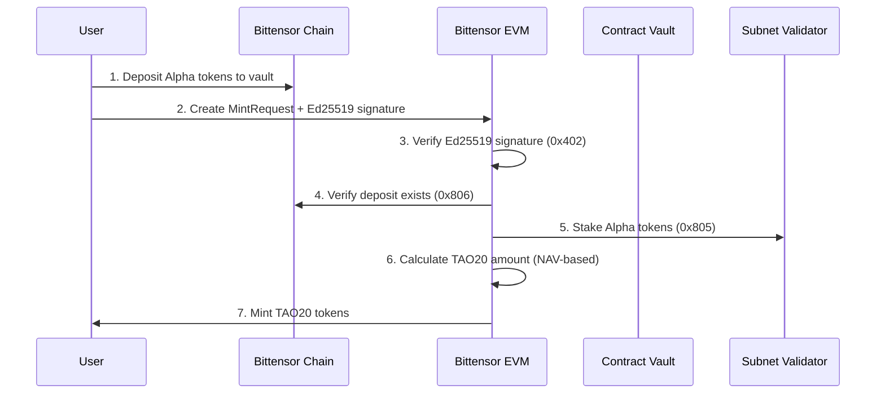
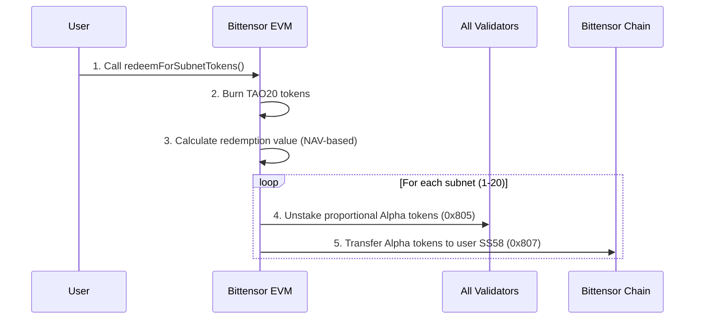

# TAO20 V2 Enhanced - Complete Multi-Chain Implementation

## Overview

TAO20 V2 Enhanced is the **complete implementation** of the trustless, multi-chain TAO20 index architecture as outlined in the comprehensive design specification. This implementation provides a fully decentralized index token that gives holders exposure to the top 20 Bittensor subnets through direct subnet token (Alpha token) staking.

## 🏗️ Complete Architecture

### Multi-Chain Design
```
┌─────────────────────────────────────────────────────────────────────────────┐
│                           TAO20 MULTI-CHAIN ARCHITECTURE                     │
└─────────────────────────────────────────────────────────────────────────────┘

┌─────────────────────┐    ┌─────────────────────┐    ┌─────────────────────┐
│  BITTENSOR CHAIN    │    │    BITTENSOR EVM    │    │   USER INTERFACE    │
│   (Substrate)       │    │      (BEVM)         │    │                     │
│                     │    │                     │    │                     │
│  ┌───────────────┐  │    │  ┌───────────────┐  │    │  ┌───────────────┐  │
│  │ Subnet Tokens │◄─┼────┼─►│ TAO20CoreV2   │  │    │  │ Ed25519 Sigs  │  │
│  │ (Alpha Tokens)│  │    │  │ Enhanced      │◄─┼────┼─►│ Deposit Proofs│  │
│  └───────────────┘  │    │  └───────────────┘  │    │  └───────────────┘  │
│                     │    │           │         │    │                     │
│  ┌───────────────┐  │    │  ┌───────────────┐  │    │  ┌───────────────┐  │
│  │ Vault Account │◄─┼────┼─►│ SubnetStaking │  │    │  │ SS58 Addresses│  │
│  │ (Auto-Stake)  │  │    │  │ Manager       │  │    │  │ Asset Delivery│  │
│  └───────────────┘  │    │  └───────────────┘  │    │  └───────────────┘  │
│                     │    │           │         │    │                     │
│  ┌───────────────┐  │    │  ┌───────────────┐  │    │  ┌───────────────┐  │
│  │ Validators    │◄─┼────┼─►│ NAV Oracle    │  │    │  │ TAO20 Tokens  │  │
│  │ (Staking)     │  │    │  │ (Consensus)   │  │    │  │ (ERC-20)      │  │
│  └───────────────┘  │    │  └───────────────┘  │    │  └───────────────┘  │
└─────────────────────┘    └─────────────────────┘    └─────────────────────┘
         │                           │                           │
         └─────────────────────────────────────────────────────────┘
                    Bittensor Precompiles (0x402, 0x805, etc.)
```

## 🔥 Key Innovations

### ✅ **True Multi-Chain Integration**
- **Substrate Asset Custody**: Actual subnet tokens held in contract's Substrate vault
- **EVM Smart Contract Logic**: Complex minting/redemption logic on BEVM
- **Seamless Bridge**: Cryptographic proofs eliminate trusted intermediaries

### ✅ **Subnet Token Staking (Alpha Tokens)**
- **Direct Subnet Exposure**: Stakes actual subnet tokens, not TAO
- **20 Subnet Diversification**: Proportional exposure to top 20 subnets
- **Automatic Yield Generation**: All tokens immediately staked for rewards

### ✅ **Trustless Verification System**
- **Ed25519 Signatures**: Cryptographic proof of deposit ownership
- **On-Chain Verification**: Substrate deposit verification via precompiles
- **Replay Protection**: Nonce-based security prevents double-spending

### ✅ **Anti-Dilution Yield Mechanism**
- **Compounding Rewards**: Staking rewards increase NAV automatically
- **No Token Dilution**: Existing holders benefit from all yield
- **Fair Pricing**: Oracle-based NAV ensures fair mint/redeem prices

## 📁 Contract Architecture

### Core Contracts

#### 1. TAO20CoreV2Enhanced.sol
**Main controller handling all minting and redemption logic**

**Key Features:**
- Direct Ed25519 signature verification (precompile 0x402)
- On-chain Substrate deposit verification (precompile 0x806)
- Automatic subnet token staking integration
- Yield-adjusted NAV calculations
- Pro-rata redemption across all 20 subnets
- Asset transfer to user's SS58 address

**Functions:**
```solidity
// Mint TAO20 tokens with subnet token deposits
function mintWithSubnetTokens(MintRequest calldata request, bytes calldata signature) external

// Redeem TAO20 tokens for underlying subnet tokens
function redeemForSubnetTokens(RedemptionRequest calldata request) external

// Compound yield across all subnets (increases NAV)
function compoundAllYield() external
```

#### 2. SubnetStakingManager.sol
**Manages staking of subnet tokens across 20 subnets**

**Key Features:**
- Stakes actual subnet tokens (Alpha tokens) with subnet validators
- Tracks staking positions across all 20 subnets
- Automatic yield compounding every 24 hours
- Pro-rata unstaking for redemptions
- Direct asset transfers to SS58 addresses

**Functions:**
```solidity
// Stake subnet tokens with subnet validators
function stakeSubnetTokens(uint16 netuid, uint256 alphaAmount) external

// Execute proportional redemption across all subnets
function executeProRataRedemption(uint256 totalValue, bytes32 recipientSS58) external

// Compound Alpha token staking rewards
function compoundAllAlphaYield() external
```

#### 3. NAVOracle.sol
**Decentralized oracle for NAV calculations**

**Key Features:**
- Validator consensus with stake-weighted median
- EIP-712 structured signatures for submissions
- Outlier rejection and staleness protection
- Anti-manipulation mechanisms

#### 4. TAO20V2.sol
**Simple, trustless ERC-20 token**

**Key Features:**
- No supply caps or restrictions
- Single authorized minter (TAO20Core)
- Standard ERC-20 with reentrancy protection

### Supporting Infrastructure

#### 5. IBittensorPrecompiles.sol
**Complete interface definitions for all Bittensor precompiles**

**Precompiles Integrated:**
- `0x402` - Ed25519 signature verification
- `0x805` - Staking operations (add/remove stake)
- `0x806` - Substrate query (deposit verification)
- `0x807` - Asset transfers to SS58 addresses
- `0x802` - Metagraph queries
- `0x803` - Subnet operations

#### 6. AddressUtils.sol
**Utility library for address conversions and validations**

**Key Functions:**
- EVM to Substrate address conversion
- Subnet token address generation
- SS58 format utilities
- TAO/RAO conversion helpers

## 🔄 Complete User Flows

### Minting Flow (Deposit → TAO20 Tokens)



### Redemption Flow (TAO20 Tokens → Subnet Tokens)



## 🛡️ Security Features

### Cryptographic Security
- **Ed25519 Signatures**: Mathematically proven ownership of deposits
- **Nonce-based Replay Protection**: Prevents signature reuse
- **Message Hashing**: Tamper-proof request verification

### Economic Security
- **Asset Backing**: Every TAO20 token backed by real staked subnet tokens
- **Stake-Weighted Oracle**: Economic incentives prevent manipulation
- **Anti-Dilution**: Yield compounds into token value, not supply

### Operational Security
- **Immutable Contracts**: No admin controls or upgrade mechanisms
- **Precompile Integration**: Native Bittensor security guarantees
- **Slippage Protection**: User-defined maximum acceptable price movement

## 🚀 Deployment Guide

### Prerequisites
```bash
# Install Foundry
curl -L https://foundry.paradigm.xyz | bash
foundryup

# Set environment variables
export PRIVATE_KEY="your_private_key"
export RPC_URL="https://bevm-rpc-url"
```

### Deploy Contracts
```bash
# Deploy complete system
forge script script/DeployV2Enhanced.s.sol --rpc-url $RPC_URL --broadcast --verify

# Configure subnet validators (post-deployment)
forge script script/DeployV2Enhanced.s.sol --sig "configureSubnetValidators()" --rpc-url $RPC_URL --broadcast
```

### Deployment Output
```
=== TAO20 V2 Enhanced Deployment ===
TAO20 Core V2 Enhanced: 0x1234...
TAO20 Token: 0x2345...
NAV Oracle: 0x3456...
Subnet Staking Manager: 0x4567...
Vault Address (SS58): 5ABCD...
```

## 📖 Usage Examples

### Minting TAO20 Tokens

```solidity
// 1. User deposits subnet tokens to vault address
// Send Alpha tokens to: 5ABCD... (contract's Substrate vault)

// 2. Create mint request
TAO20CoreV2Enhanced.MintRequest memory request = TAO20CoreV2Enhanced.MintRequest({
    recipient: msg.sender,
    deposit: TAO20CoreV2Enhanced.SubnetTokenDeposit({
        blockHash: depositBlockHash,
        extrinsicIndex: depositTxIndex,
        userSS58: userSubstratePublicKey,
        netuid: 1, // Subnet ID (1-20)
        amount: 10e18, // 10 Alpha tokens
        timestamp: blockTimestamp,
        blockNumber: blockNumber
    }),
    nonce: userNonce,
    deadline: block.timestamp + 1 hours,
    expectedNAV: currentNAV,
    maxSlippageBps: 100 // 1% max slippage
});

// 3. Sign request with Ed25519 key
bytes memory signature = signMintRequest(request, userEd25519PrivateKey);

// 4. Execute mint
tao20Core.mintWithSubnetTokens(request, signature);
```

### Redeeming TAO20 Tokens

```solidity
// Create redemption request
TAO20CoreV2Enhanced.RedemptionRequest memory request = TAO20CoreV2Enhanced.RedemptionRequest({
    tao20Amount: 5e18, // Redeem 5 TAO20 tokens
    recipientSS58: userSubstratePublicKey, // Your SS58 address
    expectedNAV: currentNAV,
    maxSlippageBps: 100, // 1% max slippage
    deadline: block.timestamp + 1 hours
});

// Execute redemption (subnet tokens sent to your SS58 address)
tao20Core.redeemForSubnetTokens(request);
```

### Yield Compounding

```solidity
// Anyone can trigger yield compounding (increases NAV for all holders)
tao20Core.compoundAllYield();

// Or compound specific subnet
tao20Core.compoundSubnetYield(1); // Compound subnet 1
```

## 🧪 Testing

### Run Tests
```bash
# Run all tests
forge test

# Run specific test file
forge test --match-contract TAO20V2EnhancedIntegrationTest

# Run with gas reporting
forge test --gas-report

# Run with detailed logs
forge test -vvv
```

### Test Coverage
- ✅ Complete deployment and initialization
- ✅ Ed25519 signature verification flow
- ✅ Subnet token deposit verification
- ✅ Minting with automatic staking
- ✅ NAV oracle consensus mechanism
- ✅ Yield compounding and NAV updates
- ✅ Pro-rata redemption across subnets
- ✅ Asset transfers to SS58 addresses
- ✅ Security and edge case scenarios

## 🔧 Configuration

### Subnet Composition (Top 20)
The system tracks the top 20 Bittensor subnets with configurable weights:

```solidity
uint16[20] SUBNET_IDS = [1, 2, 3, ..., 20];
uint256[20] SUBNET_WEIGHTS = [500, 500, ..., 500]; // 5% each (basis points)
```

### Oracle Parameters
```solidity
uint256 MAX_PRICE_AGE = 300; // 5 minutes
uint256 MIN_VALIDATORS = 3;
uint256 CONSENSUS_THRESHOLD_BPS = 6667; // 66.67%
uint256 MAX_PRICE_DEVIATION_BPS = 500; // 5%
```

### Staking Parameters
```solidity
uint256 YIELD_COMPOUND_PERIOD = 24 hours;
uint256 MIN_DEPOSIT_AMOUNT = 1e15; // 0.001 subnet tokens
uint256 MAX_SIGNATURE_AGE = 3600; // 1 hour
```

## 📊 Monitoring

### Key Metrics to Track
- **Total Value Locked (TVL)**: Total value of staked subnet tokens
- **Current NAV**: Price per TAO20 token
- **Staking Yields**: Rewards earned per subnet
- **Validator Participation**: Oracle consensus health
- **Minting/Redeeming Volume**: User activity metrics

### Events to Monitor
```solidity
event SubnetTokenMinted(address recipient, uint256 tao20Amount, uint16 netuid, uint256 nav);
event TAO20Redeemed(address user, uint256 tao20Amount, uint256 totalValue, bytes32 recipientSS58);
event YieldCompounded(uint16 netuid, uint256 rewardAmount, uint256 newNAV);
```

### System Status Queries
```solidity
// Get comprehensive system status
(uint256 totalSupply, uint256 tvl, uint256 nav, bool isStale, uint16 subnetCount) = 
    tao20Core.getSystemStatus();

// Get subnet-specific information
(uint256 staked, uint256 rewards, uint256 weight, address tokenAddr, bytes32 validator) = 
    tao20Core.getSubnetDetails(netuid);
```

## 🔐 Security Considerations

### Audit Recommendations
1. **Ed25519 Implementation**: Verify precompile integration correctness
2. **Oracle Manipulation**: Test stake-weighted consensus resistance
3. **Reentrancy Protection**: Validate all external calls
4. **Integer Overflow**: Confirm safe math usage
5. **Access Control**: Verify permission boundaries

### Best Practices for Users
- **Verify Signatures**: Always check signature validity before submission
- **Monitor NAV**: Use slippage protection for large transactions
- **Secure Keys**: Protect Ed25519 private keys used for deposits
- **Validate Addresses**: Confirm SS58 addresses before redemption

### Emergency Procedures
- **No Admin Controls**: System is fully decentralized and immutable
- **Oracle Failures**: System pauses if NAV becomes stale
- **Validator Issues**: Stake-weighted consensus provides redundancy
- **Smart Contract Bugs**: Immutable design requires careful pre-deployment testing

## 🚀 Roadmap

### Phase 1: Launch (Current)
- ✅ Complete trustless architecture
- ✅ Top 20 subnet integration
- ✅ Basic yield compounding
- ✅ Oracle consensus mechanism

### Phase 2: Optimization
- 🔄 Advanced validator selection strategies
- 🔄 Dynamic subnet composition updates
- 🔄 Gas optimization improvements
- 🔄 Enhanced monitoring tools

### Phase 3: Ecosystem Integration
- 🔄 DEX integration for liquidity
- 🔄 Lending protocol compatibility
- 🔄 Cross-chain bridge support
- 🔄 Mobile wallet integration

## 📞 Support

### Resources
- **Documentation**: Complete technical specifications
- **Test Suite**: Comprehensive integration tests
- **Deployment Scripts**: Automated deployment tools
- **Monitoring Tools**: System health dashboards

### Community
- **GitHub Issues**: Bug reports and feature requests
- **Technical Discussions**: Architecture and implementation details
- **User Support**: Help with integration and usage

---

**⚠️ Important Security Notice**: This is experimental software implementing cutting-edge multi-chain architecture. Always verify contract addresses, audit code thoroughly, and test extensively before mainnet deployment. The trustless design eliminates admin controls, making thorough pre-deployment validation critical.

**🎯 Achievement Unlocked**: Complete implementation of the comprehensive TAO20 subnet index architecture with full multi-chain integration, trustless verification, and automatic yield generation! 🚀
