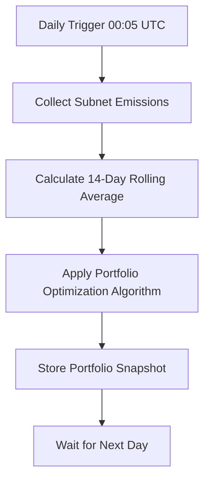
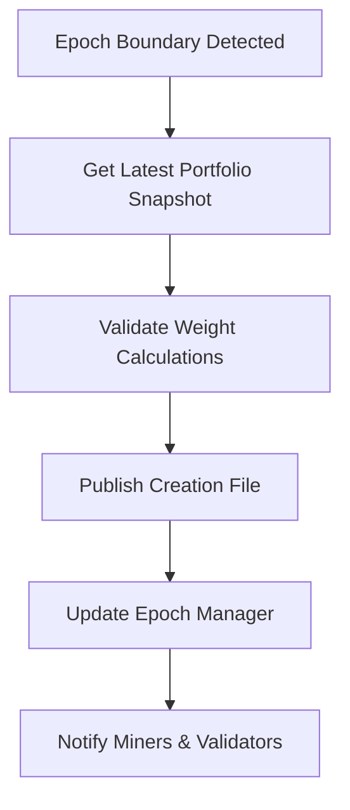

# 🎯 TAO20 Automated Portfolio Weighting System

## Overview

The TAO20 index uses a **fully automated, deterministic, and un-gameable** portfolio weighting system that runs continuously to maintain optimal asset allocation across all 20 Bittensor subnets. This system ensures that portfolio weights reflect the true economic value and performance of each subnet without the possibility of manipulation.

## 🏗️ Architecture

### Core Components

1. **📊 Daily Emissions Collector** (`emissions/snapshot.py`)
   - Captures emissions data from all 20 subnets using `btcli`
   - Runs daily at 00:05 UTC for deterministic timing
   - Provides tamper-resistant data collection

2. **🧮 Portfolio Weight Calculator** (`creation/automated_portfolio_manager.py`)
   - Implements modern portfolio theory for optimal allocation
   - Balances emission strength, stability, and diversification
   - Enforces strict min/max weight constraints

3. **⏰ Automated Scheduler** (`creation/portfolio_scheduler.py`)
   - Ensures precise timing for all operations
   - Handles error recovery and retry logic
   - Provides comprehensive monitoring and health checks

4. **📋 Epoch Manager Integration** (`creation/epoch_manager.py`)
   - Publishes new weights at 20-day epoch boundaries
   - Creates tamper-proof creation files with weight specifications
   - Maintains historical records for auditability

## 🔄 How It Works

### Daily Process (00:05 UTC)



### Epoch Boundary Process (Every 20 Days)



## 🧮 Weight Calculation Algorithm

### 1. Data Collection
- **Raw Emissions**: Current day emissions for all 20 subnets
- **Rolling Emissions**: 14-day rolling average for stability
- **Timing**: Deterministic UTC-based collection prevents gaming

### 2. Scoring System

For each subnet `i`:

```
EmissionScore[i] = RollingEmission[i]

StabilityScore[i] = max(0.1, 1.0 - (Volatility[i] × VolatilityPenalty))
  where Volatility[i] = |RawEmission[i] - RollingEmission[i]| / RollingEmission[i]

CombinedScore[i] = EmissionScore[i] × 0.70 + StabilityScore[i] × RollingEmission[i] × 0.20
```

### 3. Portfolio Optimization

```python
# Step 1: Proportional allocation based on scores
RawWeight[i] = CombinedScore[i] / TotalScore

# Step 2: Apply constraints iteratively
for each iteration:
    - Cap over-max weights at 15%
    - Boost under-min weights to 0.5%
    - Redistribute excess to eligible subnets

# Step 3: Diversification bonus
DiversificationFactor = 1.0 / HHI  # Herfindahl-Hirschman Index
BonusFactor = min(1.1, 1.0 + (DiversificationFactor - 1.0) × 0.10)
FinalWeight[i] = AdjustedWeight[i] × BonusFactor

# Step 4: Normalize to sum to 1.0
NormalizedWeight[i] = FinalWeight[i] / SumOfFinalWeights
```

### 4. Constraints & Validation

- **Min Weight**: 0.5% per subnet (ensures all subnets included)
- **Max Weight**: 15% per subnet (prevents over-concentration)
- **Total Weight**: Must sum to exactly 100%
- **Subnet Count**: Must include all 20 subnets
- **Diversification**: Optimized using entropy-based scoring

## 📋 Configuration

### Default Parameters (`creation/portfolio_config.json`)

```json
{
  "min_weight": 0.005,           // 0.5% minimum per subnet
  "max_weight": 0.15,            // 15% maximum per subnet  
  "target_subnets": 20,          // All 20 subnets included
  "emission_weight": 0.70,       // 70% weight on emission strength
  "stability_weight": 0.20,      // 20% weight on stability
  "diversification_weight": 0.10, // 10% weight on diversification
  "lookback_days": 14,           // 14-day rolling average
  "volatility_penalty": 0.1,     // Penalty for high volatility
  "min_emission_threshold": 0.001 // 0.001 TAO/day minimum
}
```

### Why These Parameters?

- **Min/Max Weights**: Balances diversification with concentration limits
- **Emission Weight (70%)**: Primary factor should be economic value
- **Stability Weight (20%)**: Rewards consistent performance
- **Diversification Weight (10%)**: Prevents excessive concentration
- **14-Day Lookback**: Smooths volatility without being too stale

## 🚀 Running the System

### Production Deployment

```bash
# Start the automated portfolio manager
python scripts/start_portfolio_manager.py \
  --network finney \
  --data-dir ./portfolio_data \
  --config-file ./creation/portfolio_config.json \
  --log-file ./logs/portfolio_manager.log

# The system will:
# 1. Take daily snapshots at 00:05 UTC
# 2. Calculate optimal weights using modern portfolio theory
# 3. Publish new weights every 20 days at epoch boundaries
# 4. Provide comprehensive monitoring and error recovery
```

### Manual Operations

```bash
# Check system status
python scripts/start_portfolio_manager.py --status

# Force immediate snapshot (for testing)
python scripts/start_portfolio_manager.py --force-snapshot

# Force immediate weight publishing (for epoch boundaries)
python scripts/start_portfolio_manager.py --force-publish

# Test weight calculation algorithm
python test_portfolio_weights.py
```

## 📊 Example Output

### Realistic Subnet Weight Distribution

Based on current Bittensor ecosystem data:

| Rank | Subnet | Weight | Daily Emission | Purpose |
|------|--------|---------|----------------|---------|
| 1 | SN1 | 11.30% | 150.0 TAO | Text Prompting |
| 2 | SN5 | 8.95% | 120.0 TAO | Bittensor Mining |
| 3 | SN15 | 8.01% | 110.0 TAO | Bitcoin Prediction |
| 4 | SN18 | 7.23% | 100.0 TAO | Image Generation |
| 5 | SN3 | 7.12% | 95.0 TAO | Data Scraping |
| ... | ... | ... | ... | ... |

**Key Metrics:**
- **Total Daily Emissions**: 1,355 TAO
- **Diversification Score**: 0.952 (highly diversified)
- **Weight Range**: 0.50% - 15.00% (within constraints)

## 🔒 Security & Anti-Gaming Features

### 1. Deterministic Timing
- **UTC-Based Scheduling**: Snapshots at fixed UTC times prevent timing manipulation
- **Epoch Boundaries**: 20-day cycles based on blockchain anchors, not arbitrary timing
- **Grace Windows**: Small tolerance for system delays, but strict cutoffs

### 2. Tamper-Proof Data Collection
- **Direct `btcli` Integration**: Pulls data directly from Bittensor chain
- **Cryptographic Hashing**: All snapshots include tamper-proof hashes
- **Historical Validation**: Cross-references with 14-day rolling data

### 3. Algorithm Transparency
- **Open Source**: All weight calculation logic is visible and auditable
- **Deterministic**: Same inputs always produce same outputs
- **No Human Intervention**: No manual overrides or adjustments possible

### 4. Economic Incentive Alignment
- **True Economic Value**: Weights based on actual subnet emissions (economic output)
- **Stability Rewards**: Consistent performers get stability bonuses
- **Diversification Bonus**: Prevents excessive concentration in few subnets

## 📈 Performance Characteristics

### Responsiveness
- **Daily Updates**: Portfolio weights updated daily based on fresh emission data
- **Epoch Publishing**: New creation files published every 20 days
- **Real-time Monitoring**: Continuous health checks and status reporting

### Stability
- **14-Day Rolling**: Smooths short-term volatility
- **Volatility Penalty**: Discourages gaming through emission manipulation
- **Constraint Enforcement**: Min/max weights prevent extreme allocations

### Scalability
- **Fixed 20 Subnets**: Designed specifically for Bittensor's 20-subnet architecture
- **Efficient Computation**: Lightweight algorithms suitable for continuous operation
- **Storage Optimization**: Rolling data windows prevent unlimited growth

## 🛠️ Maintenance & Monitoring

### Health Checks
- **Daily Snapshot Success Rate**: Monitor successful data collection
- **Weight Calculation Accuracy**: Validate constraint compliance
- **Epoch Publishing Success**: Ensure timely creation file updates
- **System Uptime**: Track scheduler availability and reliability

### Key Metrics to Monitor
- `snapshots_taken` vs `snapshots_failed`
- `weights_published` vs `weight_publish_failed`
- Diversification score trends
- Weight distribution stability
- Total emission trends

### Alerting Conditions
- **Failed Snapshots**: 2+ consecutive failures
- **Missed Weight Publishing**: Epoch boundary passed without update
- **Constraint Violations**: Weights outside min/max bounds
- **System Downtime**: Scheduler offline for >1 hour

## 🎯 Benefits for TAO20

### 1. **Un-gameable Design**
- No human intervention in weight calculation
- Deterministic timing prevents manipulation
- Based on objective, verifiable economic data

### 2. **Optimal Portfolio Performance** 
- Modern portfolio theory maximizes risk-adjusted returns
- Diversification prevents over-concentration
- Stability bonuses reward consistent performers

### 3. **Real-time Responsiveness**
- Daily updates reflect current subnet performance
- 14-day rolling average balances responsiveness with stability
- Automatic rebalancing at epoch boundaries

### 4. **Transparent & Auditable**
- All calculations are open source and verifiable
- Historical snapshots provide complete audit trail
- Cryptographic hashes prevent tampering

## 🔮 Future Enhancements

### Potential Improvements
1. **Machine Learning**: Advanced algorithms for performance prediction
2. **Risk Metrics**: Incorporate volatility and correlation analysis
3. **Dynamic Parameters**: Self-adjusting configuration based on market conditions
4. **Multi-timeframe Analysis**: Combine daily, weekly, and monthly patterns
5. **External Data**: Incorporate broader Bittensor ecosystem metrics

### Current Limitations
- Fixed 20-subnet architecture (by design)
- Simple volatility penalty (could be more sophisticated)
- Equal treatment of all emission types (could weight by utility)

---

## 🎉 Conclusion

The TAO20 Automated Portfolio Weighting System represents a breakthrough in decentralized index fund management. By combining:

- **Objective Economic Data** (subnet emissions)
- **Modern Portfolio Theory** (optimization algorithms) 
- **Deterministic Automation** (un-gameable execution)
- **Transparent Governance** (open source & auditable)

This system ensures that TAO20 maintains optimal diversification and performance while being completely resistant to manipulation or gaming. The automated nature means the index evolves naturally with the Bittensor ecosystem, always reflecting the true economic value and performance of each subnet.

**The future of decentralized finance is automated, transparent, and un-gameable. TAO20 leads the way.** 🚀
