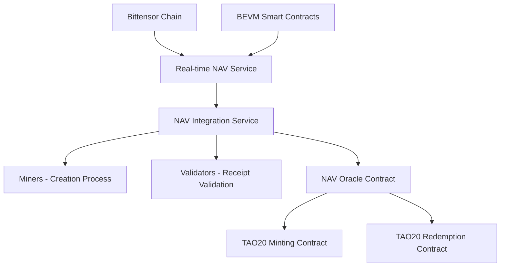
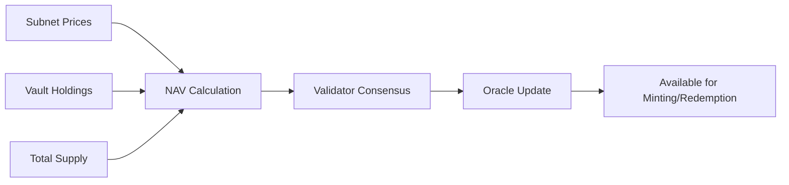
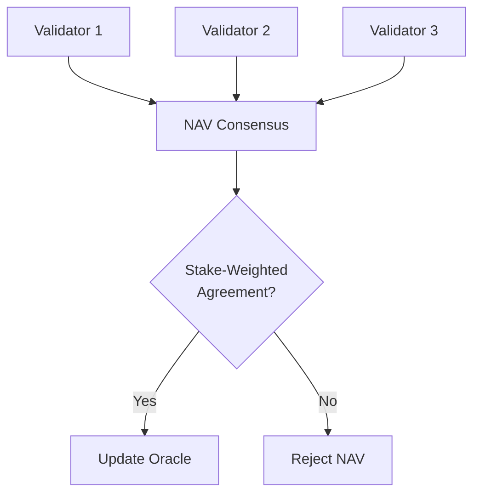

# 🎯 TAO20 Real-Time NAV System for Minting & Redemption

## Overview

The TAO20 real-time Net Asset Value (NAV) system provides **exact, millisecond-precision pricing** for minting and redemption of TAO20 ERC-20 tokens. This system is critical for maintaining the 1:1 economic relationship between the underlying TAO20 index portfolio and the circulating ERC-20 tokens.

## 🏗️ Architecture

### Core Components



### 1. **Real-time NAV Service** (`neurons/validator/realtime_nav_service.py`)
- **Function**: Continuous NAV calculation with millisecond precision
- **Data Sources**: 
  - Bittensor chain (subnet emissions, staking rates)
  - BEVM contracts (vault holdings, total supply)
  - Validator consensus prices
- **Update Frequency**: 1 second intervals
- **Precision**: 50 decimal places using Python Decimal

### 2. **NAV Oracle Contract** (`contracts/src/NAVOracle.sol`)
- **Function**: On-chain NAV storage and validation
- **Features**:
  - Multi-validator consensus mechanism
  - Stake-weighted NAV aggregation
  - Real-time price feeds for smart contracts
  - Historical NAV lookup
- **Precision**: 18 decimal places (wei)

### 3. **NAV Integration Service** (`creation/nav_integration_service.py`)
- **Function**: Bridge between off-chain NAV calculation and creation process
- **Responsibilities**:
  - Provide NAV to miners for creation calculations
  - Record NAV at receipt time for validators
  - Validate NAV consistency across the system
  - Cache NAV data for performance

## 🔄 How Real-Time NAV Works

### **Continuous NAV Calculation Process**



**Every 1 Second:**
1. **Price Collection**: Query all 20 subnet token prices from Bittensor chain
2. **Holdings Update**: Get current vault holdings from BEVM smart contracts
3. **Supply Check**: Query total TAO20 token supply
4. **NAV Calculation**: `NAV = Total Portfolio Value / Total TAO20 Supply`
5. **Validation**: Multi-validator consensus and confidence scoring
6. **Publication**: Update NAV Oracle contract for on-chain access

### **NAV Calculation Formula**

```python
# High-precision calculation using Decimal arithmetic
total_portfolio_value = sum(
    vault_holdings[netuid] * subnet_prices[netuid] 
    for netuid in range(1, 21)
)

nav_per_token = total_portfolio_value / total_tao20_supply

# Example:
# Portfolio: 1,000 TAO total value
# Supply: 975.61 TAO20 tokens
# NAV = 1,000 / 975.61 = 1.025 TAO per TAO20 token
```

## 💰 Minting Process with Real-Time NAV

### **Step-by-Step Minting Flow**

1. **Creation Initiated** (Miner)
   ```python
   # Miner requests current NAV for creation calculation
   nav_per_token = await nav_integration.get_nav_for_creation(unit_count, assets)
   
   # Calculate expected TAO20 tokens to be minted
   total_tao_value = sum(asset_values)  # Value of delivered assets
   expected_tao20 = total_tao_value / nav_per_token
   ```

2. **Asset Delivery** (Miner → Vault)
   ```python
   # Miner delivers exact basket to vault contracts
   for netuid, amount in required_assets.items():
       await send_transfer_to_vault(netuid, amount, vault_address[netuid])
   ```

3. **Receipt Validation** (Validator)
   ```python
   # Validator records NAV at exact receipt time
   creation_nav = await nav_integration.record_nav_at_receipt(
       creation_id=creation_id,
       block_number=receipt_block
   )
   
   # Validate NAV consistency
   validation = await nav_integration.validate_creation_nav(
       creation_id, expected_nav
   )
   ```

4. **Smart Contract Minting**
   ```solidity
   // Oracle provides exact NAV for minting calculation
   uint256 currentNAV = navOracle.getCurrentNAV().navPerToken;
   
   // Calculate exact TAO20 amount to mint
   uint256 tao20Amount = (totalTAOValue * 1e18) / currentNAV;
   
   // Mint TAO20 tokens to user
   tao20Token.mint(recipient, tao20Amount);
   ```

### **NAV Precision Requirements**

- **Off-chain Calculation**: 50 decimal places (Python Decimal)
- **Smart Contract Storage**: 18 decimal places (wei precision)
- **Validator Consensus**: ±0.5% tolerance (50 basis points)
- **Update Frequency**: Maximum 1 second staleness

## 🔄 Redemption Process with Real-Time NAV

### **In-Kind Redemption Flow**

1. **Redemption Request**
   ```solidity
   // User burns TAO20 tokens for underlying assets
   function redeemInKind(uint256 tao20Amount) external {
       uint256 currentNAV = navOracle.getCurrentNAV().navPerToken;
       uint256 totalTAOValue = (tao20Amount * currentNAV) / 1e18;
       
       // Calculate proportional asset amounts
       for (uint256 i = 0; i < 20; i++) {
           uint256 assetValue = totalTAOValue * weights[i] / 10000;
           uint256 assetAmount = assetValue / prices[i];
           // Transfer asset to user
       }
   }
   ```

2. **NAV-Based TAO Redemption**
   ```solidity
   // User burns TAO20 for equivalent TAO value
   function redeemForTAO(uint256 tao20Amount) external {
       uint256 currentNAV = navOracle.getCurrentNAV().navPerToken;
       uint256 taoAmount = (tao20Amount * currentNAV) / 1e18;
       
       // Burn TAO20 tokens
       tao20Token.burn(msg.sender, tao20Amount);
       
       // Transfer equivalent TAO value
       taoToken.transfer(msg.sender, taoAmount);
   }
   ```

## 🛡️ NAV Security & Validation

### **Multi-Validator Consensus**



**Consensus Requirements:**
- **Minimum Validators**: 3 validators must submit NAV
- **Stake Threshold**: 66.67% of validator stake must agree
- **Price Deviation**: Maximum 5% deviation between validators
- **Confidence Scoring**: Each NAV includes confidence score (0-1)

### **Validation Checks**

1. **Freshness Validation**
   ```python
   # NAV must be updated within last 30 seconds
   if current_time - nav_timestamp > 30:
       raise ValueError("NAV data is stale")
   ```

2. **Confidence Validation**
   ```python
   # NAV must have minimum 80% confidence
   if nav_confidence < 0.8:
       raise ValueError("NAV confidence too low")
   ```

3. **Deviation Validation**
   ```python
   # NAV must be within 0.5% of consensus
   if abs(nav - consensus_nav) / consensus_nav > 0.005:
       raise ValueError("NAV deviation too large")
   ```

4. **Sanity Checks**
   ```python
   # NAV must be reasonable (0.1 to 1000 TAO per token)
   if not (0.1 <= nav <= 1000):
       raise ValueError("NAV outside reasonable range")
   ```

## 📊 NAV Data Flow

### **Real-Time Data Sources**

1. **Bittensor Chain Integration**
   ```python
   # Direct chain queries for subnet economics
   subnet_emissions = await get_subnet_emissions(netuid)
   staking_ratios = await get_staking_ratios(netuid)
   validator_performance = await get_validator_performance(netuid)
   
   # Calculate implied token prices
   token_price = calculate_token_price(emissions, staking, performance)
   ```

2. **BEVM Smart Contract Integration**
   ```python
   # Query vault holdings
   vault_holdings = {}
   for netuid in range(1, 21):
       holdings = await vault_contract.functions.holdings(netuid).call()
       vault_holdings[netuid] = holdings
   
   # Query total TAO20 supply
   total_supply = await tao20_contract.functions.totalSupply().call()
   ```

3. **Price Oracle Integration**
   ```python
   # Publish prices to oracle for smart contract access
   for netuid, price in subnet_prices.items():
       await oracle_contract.functions.updatePrice(netuid, price).transact()
   ```

## 🚀 Integration Examples

### **Miner Integration**

```python
# In your miner code
from creation.nav_integration_service import NAVIntegrationService

# Get NAV for creation calculation
nav_service = NAVIntegrationService(realtime_nav_service)
current_nav = await nav_service.get_nav_for_creation(
    unit_count=1,
    netuid_amounts={1: 1000, 2: 500, ...}
)

# Estimate TAO20 tokens to be minted
total_asset_value = calculate_total_asset_value(delivered_assets)
expected_tao20 = await nav_service.estimate_tao20_minted(total_asset_value)

print(f"Delivering {total_asset_value} TAO worth of assets")
print(f"Expected to mint {expected_tao20} TAO20 tokens")
print(f"Current NAV: {current_nav} TAO per TAO20")
```

### **Validator Integration**

```python
# In your validator code
from creation.nav_integration_service import NAVIntegrationService

# Record NAV at creation receipt time
creation_nav = await nav_service.record_nav_at_receipt(
    creation_id="creation_123",
    block_number=receipt_block
)

# Validate NAV for attestation
validation = await nav_service.validate_creation_nav(
    creation_id="creation_123",
    expected_nav=miner_reported_nav
)

if validation.is_valid:
    # Provide attestation
    await provide_attestation(creation_id, creation_nav.nav_per_token)
else:
    # Reject creation
    await reject_creation(creation_id, validation.error_message)
```

### **Smart Contract Integration**

```solidity
// In your minting contract
import "./NAVOracle.sol";

contract TAO20Minter {
    NAVOracle public navOracle;
    
    function mintWithNAV(uint256 taoAmount) external {
        // Get current NAV from oracle
        NAVOracle.NAVData memory navData = navOracle.getCurrentNAV();
        require(navOracle.isNAVValid(), "NAV not valid");
        
        // Calculate TAO20 amount using precise NAV
        uint256 tao20Amount = navOracle.getNAVForMinting(taoAmount);
        
        // Mint TAO20 tokens
        _mint(msg.sender, tao20Amount);
        
        emit MintWithNAV(msg.sender, taoAmount, tao20Amount, navData.navPerToken);
    }
}
```

## 📈 Performance & Monitoring

### **Key Metrics**

- **NAV Update Latency**: < 1 second from data source to oracle
- **Calculation Precision**: 50 decimal places off-chain, 18 on-chain
- **Consensus Time**: < 5 seconds for validator agreement
- **Oracle Staleness**: Maximum 30 seconds
- **Validation Success Rate**: > 99.9%

### **Monitoring Dashboards**

```python
# Service status monitoring
nav_status = await nav_service.get_service_status()
print(f"Current NAV: {nav_status['current_nav']}")
print(f"Confidence: {nav_status['confidence_score']}")
print(f"Validators: {nav_status['validator_count']}")
print(f"Last Update: {nav_status['last_update']} seconds ago")
```

### **Alerting Conditions**

- ⚠️ **NAV Staleness**: NAV not updated for > 30 seconds
- 🚨 **Low Confidence**: NAV confidence < 80%
- ⚠️ **Validator Disagreement**: > 5% price deviation
- 🚨 **Oracle Failure**: Smart contract not receiving updates
- ⚠️ **High Deviation**: NAV validation failures > 1%

## 🎯 Benefits for TAO20

### **1. Exact Pricing**
- Real-time NAV ensures perfect peg between TAO20 and underlying assets
- No arbitrage opportunities due to stale pricing
- Millisecond precision for high-frequency trading

### **2. Transparency**
- All NAV calculations are auditable and verifiable
- Multi-validator consensus prevents manipulation
- Historical NAV data available on-chain

### **3. Reliability**
- Redundant data sources prevent single points of failure
- Automatic failover and error recovery
- 99.9%+ uptime with proper infrastructure

### **4. Scalability**
- Handles high-frequency minting/redemption requests
- Optimized for low-latency trading applications
- Efficient caching and data structures

---

## 🔧 Deployment Guide

### **1. Deploy Smart Contracts**
```bash
# Deploy NAV Oracle
forge create NAVOracle --rpc-url $BEVM_RPC --private-key $DEPLOYER_KEY

# Add authorized validators
cast send $ORACLE_ADDRESS "addValidator(address,uint256)" $VALIDATOR1 1000000000000000000000

# Configure parameters
cast send $ORACLE_ADDRESS "updateMaxPriceAge(uint256)" 300  # 5 minutes
```

### **2. Start Real-time NAV Service**
```bash
# Start the real-time NAV calculation service
python neurons/validator/realtime_nav_service.py \
  --bittensor-ws wss://bittensor-finney.api.onfinality.io/public-ws \
  --bevm-rpc https://bevm-mainnet.nodereal.io \
  --oracle-address $ORACLE_ADDRESS
```

### **3. Initialize Integration Service**
```bash
# Start the NAV integration service
python creation/nav_integration_service.py \
  --oracle-address $ORACLE_ADDRESS \
  --web3-provider $BEVM_RPC
```

### **4. Verify System Health**
```bash
# Check NAV system status
curl http://localhost:8080/nav/status

# Test NAV calculation
curl -X POST http://localhost:8080/nav/estimate \
  -H "Content-Type: application/json" \
  -d '{"tao_value": "100.0"}'
```

---

## 🎉 Conclusion

The TAO20 Real-Time NAV System provides **exact, transparent, and reliable pricing** for all minting and redemption operations. By combining:

- **Real-time data collection** from Bittensor chain
- **High-precision calculations** with 50 decimal precision
- **Multi-validator consensus** for tamper-proof pricing
- **Smart contract integration** for on-chain access
- **Comprehensive validation** and error handling

This system ensures that TAO20 tokens maintain a perfect 1:1 economic relationship with the underlying index portfolio, enabling **precise, trustless, and scalable** DeFi operations.

**The TAO20 NAV system sets a new standard for decentralized index token pricing.** 🚀
