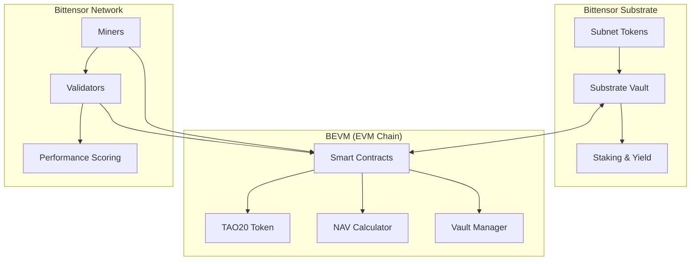

# 🏗️ TAO20 System Architecture Overview

## 📋 **Executive Summary**

TAO20 is a decentralized index token that tracks the top 20 Bittensor subnets, providing users with diversified exposure to the Bittensor ecosystem through a single, liquid ERC-20 token.

## 🎯 **Core Vision**

### **What is TAO20?**
- **Decentralized Index**: Tracks top 20 Bittensor subnets by market cap/utility
- **Cross-Chain Bridge**: Connects Bittensor Substrate with BEVM (EVM-compatible)
- **Liquid Wrapper**: Provides DeFi-compatible exposure to illiquid subnet tokens
- **Market-Based NAV**: Free-floating token price based on underlying asset values

### **Key Benefits**
- ✅ **Diversification**: Exposure to 20 top subnets in one token
- ✅ **Liquidity**: Trade subnet exposure without managing individual tokens
- ✅ **Simplicity**: Single token instead of 20 separate positions
- ✅ **Yield Generation**: Automatic staking of underlying assets
- ✅ **Market Efficiency**: Free-floating price discovery

---

## 🏗️ **System Components**

### **1. 🔗 Cross-Chain Architecture**



### **2. 🏦 Smart Contract Layer (BEVM)**

#### **Core Contracts:**
- **TAO20CoreV2OracleFree**: Main coordination contract
- **TAO20V2**: ERC-20 token implementation
- **Vault**: Cross-chain asset management
- **OracleFreeNAVCalculator**: Market-based pricing
- **StakingManager**: Yield generation management

#### **Key Features:**
- ✅ **Oracle-Free Design**: No external price dependencies
- ✅ **Immutable Contracts**: No admin controls or upgrades
- ✅ **Market-Based NAV**: Real underlying asset value calculation
- ✅ **Cross-Chain Verification**: Ed25519 signature validation
- ✅ **Automatic Yield**: Underlying assets earn staking rewards

### **3. 🔗 Bittensor Integration Layer**

#### **Precompile Integration:**
- **Ed25519 Verify** (0x402): Signature verification
- **Balance Transfer** (0x800): Cross-chain transfers
- **Substrate Query** (0x806): Deposit verification
- **Asset Transfer** (0x807): Subnet token management

#### **Cross-Chain Flow:**
1. User deposits Alpha tokens to Substrate vault
2. BEVM contracts verify deposit via precompiles
3. TAO20 tokens minted based on NAV calculation
4. Underlying assets automatically staked for yield

### **4. 🤖 Bittensor Network Layer**

#### **Simplified Miner (Core Focus):**
- **Primary Function**: Mint/redeem request processing
- **Key Activities**: Deposit verification, transaction processing
- **Incentive**: Fee collection from successful operations
- **No Complex Logic**: Simple, reliable request handling

#### **Simplified Validator (Scoring Only):**
- **Primary Function**: Score miner performance
- **Key Metrics**: Volume, speed, reliability, uptime
- **Incentive**: Bittensor emission rewards
- **No NAV Involvement**: Pure performance evaluation

#### **Automated NAV System:**
- **Function**: Calculate market-based NAV automatically
- **Data Sources**: Real subnet token prices and composition
- **Update Frequency**: Real-time with each transaction
- **No Consensus Required**: Deterministic calculation

---

## 🔄 **Core Flows**

### **📥 Minting Flow**
```bash
1. User owns 100 Alpha tokens (subnet 1)
2. User deposits → Substrate vault (5ABC...123)
3. BEVM contract verifies deposit via precompiles
4. Contract calculates TAO20 amount based on current NAV
5. TAO20 tokens minted to user's EVM address
6. Alpha tokens automatically staked for yield
```

### **📤 Redemption Flow**
```bash
1. User burns 50 TAO20 tokens
2. Contract calculates underlying asset value
3. Proportional Alpha tokens unstaked
4. Alpha tokens transferred to user's SS58 address
5. TAO20 tokens burned from circulation
```

### **🔄 NAV Calculation Flow**
```bash
1. Get current subnet composition (top 20 subnets)
2. Query market prices for each subnet token
3. Calculate weighted average based on holdings
4. Update NAV = Total Asset Value / Total Token Supply
5. No validator consensus required (automated)
```

---

## 🎯 **Architecture Principles**

### **🌟 Simplicity First**
- **Miners**: Focus solely on mint/redeem operations
- **Validators**: Focus solely on performance scoring
- **NAV Calculation**: Fully automated, no human intervention
- **Smart Contracts**: Minimal complexity, maximum security

### **🔒 Security by Design**
- **Immutable Contracts**: No admin privileges or upgrade mechanisms
- **Oracle-Free**: No external dependencies that can be manipulated
- **Cross-Chain Verification**: Cryptographic proof of deposits
- **Decentralized Operation**: No single points of failure

### **📈 Market Efficiency**
- **Free-Floating Price**: No artificial pegs or restrictions
- **Real Asset Backing**: Every token backed by real subnet tokens
- **Transparent Pricing**: Open-source NAV calculation
- **Immediate Settlement**: Real-time mint/redeem operations

### **⚡ Performance Optimization**
- **Gas Efficient**: Optimized smart contract operations
- **Scalable Architecture**: Supports high transaction volumes
- **Fast Settlement**: Sub-second transaction confirmation
- **Low Fees**: Minimal operational overhead

---

## 🌐 **Ecosystem Integration**

### **DeFi Compatibility**
- Standard ERC-20 token interface
- Compatible with all DeFi protocols
- AMM trading pairs
- Lending/borrowing collateral
- Yield farming opportunities

### **Bittensor Ecosystem**
- Direct subnet token exposure
- Automatic staking participation
- Real-time subnet performance tracking
- Seamless cross-chain operation

### **User Experience**
- Single token for entire subnet ecosystem
- No need to manage 20 separate positions
- Automatic rebalancing and optimization
- Professional-grade portfolio management

---

## 🎉 **Technical Innovations**

### **🔬 Oracle-Free NAV**
Unlike traditional index funds that rely on external price oracles, TAO20 calculates NAV directly from underlying asset values, eliminating oracle manipulation risks.

### **⚡ Cross-Chain Asset Bridge**
Seamless integration between Bittensor Substrate and BEVM enables real subnet token backing while maintaining DeFi compatibility.

### **🤖 Automated Operations**
Minimal human intervention required - NAV calculation, rebalancing, and yield generation all happen automatically.

### **🎯 Aligned Incentives**
Miners earn fees for successful operations, validators earn rewards for accurate scoring, users benefit from diversified exposure and yield generation.

---

## 📊 **System Metrics**

### **Performance Targets**
- **Transaction Finality**: < 5 seconds
- **Gas Costs**: < 100k gas per mint/redeem
- **Uptime**: > 99.9%
- **NAV Accuracy**: Real-time with each block

### **Scalability**
- **Supported Subnets**: 20 (expandable)
- **Transaction Throughput**: 1000+ per hour
- **User Capacity**: Unlimited
- **Asset Under Management**: No caps

---

## 🔮 **Future Roadmap**

### **Phase 1: Core Launch** (Current)
- Top 20 subnet support
- Basic mint/redeem functionality
- BEVM testnet deployment

### **Phase 2: Enhanced Features**
- Advanced yield strategies
- Governance token integration
- Additional subnet support

### **Phase 3: Ecosystem Expansion**
- Multi-chain deployment
- Institutional features
- Advanced DeFi integrations

---

**🎯 This architecture provides a solid foundation for the TAO20 ecosystem while maintaining simplicity, security, and scalability.**
