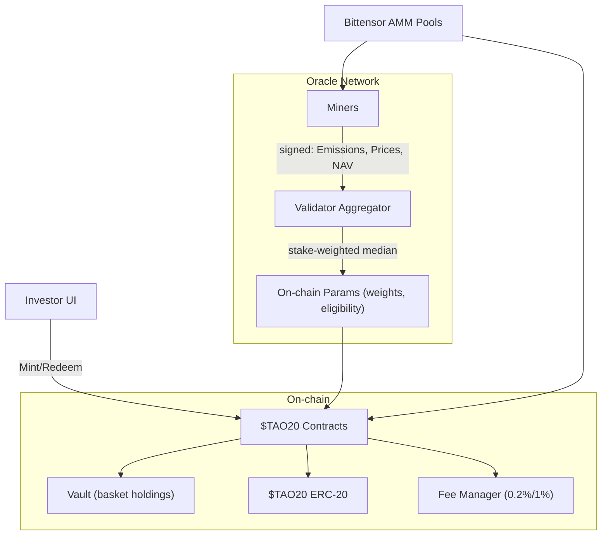

TAO20 System Architecture

Mermaid

Interfaces
- Contracts: `Tao20Token`, `Tao20Vault`, `FeeTreasury`, `ValidatorSet`, `ParamRegistry`, `Slashing`
- Miner reports: `EmissionsReport`, `PriceReport`, `NavReport`
- Validator output: `WeightSet`

Cadence
- Prices: ~60s; Emissions: daily snapshot; Rebalance: every 14 days; Mgmt fee: monthly

